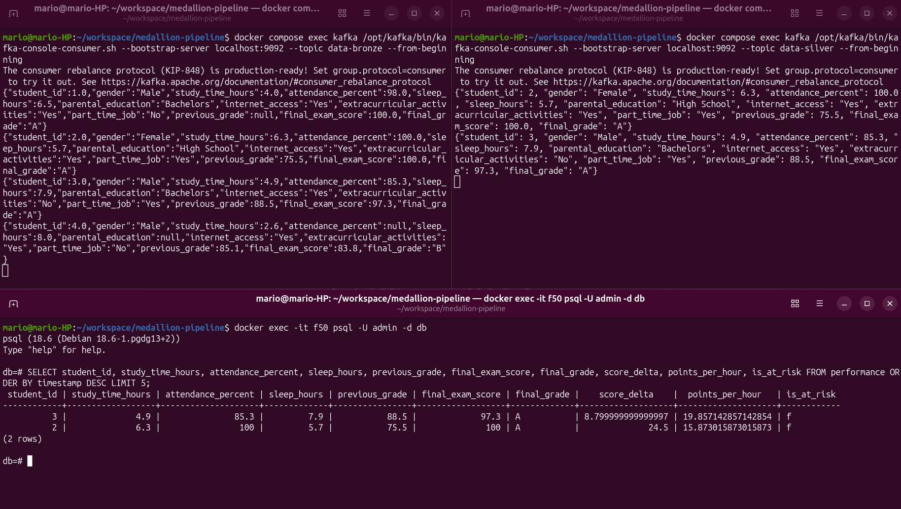

# Medallion Pipeline
[](https://python.org)
[](https://kafka.apache.org/)
[](https://www.postgresql.org/)
[](https://www.docker.com/)
[](LICENSE)

I created a pipeline to incrementally and progressively improve the quality of data following the medallion architecture.

The result is a PostgreSQL database with data ready to be used in ML projects or presented in dashboards.

## About this project

### Medallion Architecture

A medallion architecture is a data design pattern used to logically organize data in a lakehouse, with the goal of incrementally and progressively improving the structure and quality of data as it flows through each layer of the architecture (from Bronze ⇒ Silver ⇒ Gold layer tables). Medallion architectures are sometimes also referred to as "multi-hop" architectures [[Databricks](https://www.databricks.com/blog/what-is-medallion-architecture)].

The **Bronze** layer is where we land all the data from external source systems [[Databricks](https://www.databricks.com/blog/what-is-medallion-architecture)]. 

Data cleanup and validation are performed in the **Silver** layer [[Microsoft Learn](https://learn.microsoft.com/en-us/azure/databricks/lakehouse/medallion)]. 

The **Gold** layer represents highly refined views of the data that drive downstream analytics, dashboards, ML, and applications [[Microsoft Learn](https://learn.microsoft.com/en-us/azure/databricks/lakehouse/medallion)].

### Student Performance Dataset

This dataset contains information on 1000 students, including study habits (hours studied, attendance), lifestyle factors (sleep, extracurricular activities, part-time job), demographic details (gender, parental education), and academic outcomes (final exam score and letter grade) [[Kaggle](https://www.kaggle.com/datasets/harshadapatil31/student-performance-and-study-habits-dataset)]. 

The [CSV file](student_performance_dataset.csv) used in this project is a modified version from the original. More null values were added.

### Results

Figure 1 presents a screenshot with three open terminals. The top left terminal shows the raw data sent by [producer.py](producer.py) to the ```data-bronze``` Kafka topic. The top right terminal shows the cleaned data without any null values sent by [processor_silver.py](processor_silver.py) to the ```data-silver``` Kafka topic. Finally, the bottom terminal shows the enriched data sent by [processor_gold.py](processor_gold.py) to the PostgreSQL database, featuring the new fields *score_delta*, *points_per_hour* and *is_at_risk*. 


**Figure 1**: Consumers for the ```data-bronze``` and ```data-silver``` Kafka topics alongside the contents of the PostgreSQL ```performance``` table after 40 seconds of pipeline execution.

## Installation and usage

### Linux 

#### Prerequisites
- Docker & Docker Compose
- Conda (Miniconda or Anaconda)

#### Installation
1. Clone the repo and navigate to the project directory.
2. Create and activate the Conda environment.
```bash
conda create -n medallion-pipeline-env python=3.11 -y
conda activate medallion-pipeline-env
```
3. Install required dependencies.
```bash
conda install -c conda-forge confluent-kafka pandas psycopg2 -y
```

#### Usage
1. Start the Kafka and PostgreSQL containers.
```bash
docker compose up -d
```
2. Run the Gold processor in the background or in a separate terminal.
```bash
python processor_gold.py
```
3. Run the Silver processor.
```bash
python processor_silver.py
```
*Note: Don't worry if a Consumer error appears. The ```data-bronze``` Kafka topic is not created yet.*

4. Start streaming the CSV rows via the Bronze producer.
```bash
python producer.py
```
5. Verify data in PostgreSQL.
```bash
docker exec -it postgres psql -U admin -d db -c "SELECT student_id, study_time_hours, attendance_percent, sleep_hours, previous_grade, final_exam_score, final_grade, score_delta, points_per_hour, is_at_risk FROM performance ORDER BY timestamp DESC LIMIT 5;"
```
6. *EXTRA* Verify data in ```data-bronze``` Kafka topic.
```bash
docker compose exec kafka /opt/kafka/bin/kafka-console-consumer.sh --bootstrap-server localhost:9092 --topic data-bronze --from-beginning
```
7. *EXTRA* Verify data in ```data-silver``` Kafka topic.
```bash
docker compose exec kafka /opt/kafka/bin/kafka-console-consumer.sh --bootstrap-server localhost:9092 --topic data-silver --from-beginning
```

### Windows 

#### Prerequisites
- Docker & Docker Compose (with WSL 2 backend enabled)
- Conda (Miniconda or Anaconda Prompt)

#### Installation
1. Open PowerShell or Anaconda Prompt, clone the repo and navigate to the project directory.
2. Create and activate the Conda environment.
```cmd
conda create -n medallion-pipeline-env python=3.11 -y
conda activate medallion-pipeline-env
```
3. Install required dependencies.
```cmd
conda install -c conda-forge confluent-kafka pandas psycopg2 -y
```

#### Usage
1. Start the Kafka and PostgreSQL containers.
```cmd
docker compose up -d
```
2. Run the Gold processor in the background or in a separate terminal.
```cmd
python processor_gold.py
```
3. Run the Silver processor.
```cmd
python processor_silver.py
```
*Note: Don't worry if a Consumer error appears. The ```data-bronze``` Kafka topic is not created yet.*

4. Start streaming the CSV rows via the Bronze producer.
```cmd
python producer.py
```
5. Verify data in PostgreSQL.
```cmd
docker exec postgres psql -U admin -d db -c "SELECT student_id, study_time_hours, attendance_percent, sleep_hours, previous_grade, final_exam_score, final_grade, score_delta, points_per_hour, is_at_risk FROM performance ORDER BY timestamp DESC LIMIT 5;"
```
6. *EXTRA* Verify data in ```data-bronze``` Kafka topic.
```cmd
docker compose exec kafka /opt/kafka/bin/kafka-console-consumer.sh --bootstrap-server localhost:9092 --topic data-bronze --from-beginning
```
7. *EXTRA* Verify data in ```data-silver``` Kafka topic.
```cmd
docker compose exec kafka /opt/kafka/bin/kafka-console-consumer.sh --bootstrap-server localhost:9092 --topic data-silver --from-beginning
```

## Contribute

To contribute, fork the repository on GitHub, create a branch for your changes, and open a pull request describing your contribution. Bug reports and suggestions are also welcome through GitHub issues.

## License

[MIT](LICENSE)